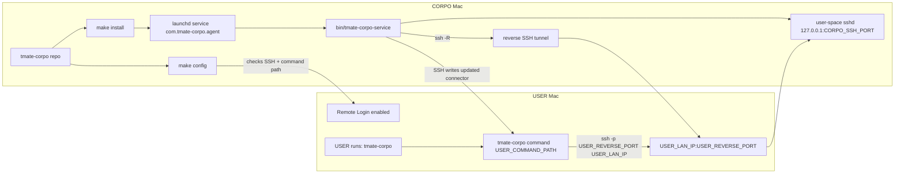

# tmate-corpo

## About

The goal of this spike is to make CORPO Macs, where normal macOS Remote Login or inbound SSH may be disabled, reachable from a personal USER Mac over the same LAN with minimum latency.

Instead of `tmate`, this branch runs a private user-space `sshd` bound to `127.0.0.1` on the CORPO Mac, then opens a reverse SSH tunnel from CORPO to the USER Mac LAN IP. That avoids inbound connections to CORPO while still letting the USER connect with normal `ssh`.

The USER Mac must be reachable from the CORPO Mac over the same LAN with Remote Login enabled, because the CORPO Mac uses SSH only to publish or refresh the small `tmate-corpo` connector command on the USER Mac. After that, the USER connects back into the CORPO Mac by running `tmate-corpo` from their personal machine.

`tmate-corpo` runs on the CORPO Mac. It keeps a background CORPO-owned `sshd` plus reverse tunnel running and publishes a simple `tmate-corpo` command to the USER Mac over SSH. The generated USER command connects to `USER_CONNECT_HOST:USER_REVERSE_PORT` on the USER Mac, which forwards over the tunnel into CORPO. By default `USER_CONNECT_HOST=auto`, so the install detects the USER Mac LAN IP.

## Architecture



Run `make config`, `make install`, and service management commands on the CORPO Mac. Run only the generated `tmate-corpo` command on the USER Mac.

## Requirements

- macOS on the CORPO Mac running the service.
- `make` installed on the CORPO Mac. On macOS, install Xcode Command Line Tools if `make` is missing:

```bash
xcode-select --install
```

- Built-in `/usr/sbin/sshd`, `ssh`, and `ssh-keygen` available on the CORPO Mac.

- Remote Login enabled on the USER Mac so CORPO can SSH into it:

```text
System Settings -> General -> Sharing -> Remote Login
```

## Install

On the CORPO Mac, configure the USER Mac once:

```bash
make config
```

This writes:

```text
.tmate-corpo.env
~/.tmate-corpo/env
```

It also checks whether the CORPO Mac can SSH into the USER Mac and whether the configured USER Mac command path is writable. If either check fails, it prints the exact next steps, such as running `ssh-copy-id user@user-mac.local` from CORPO or switching to a user-writable path.

You can also configure by editing `.tmate-corpo.env` directly. Start from:

```bash
cp .tmate-corpo.env.example .tmate-corpo.env
```

Then install and start the LaunchAgent:

```bash
make install
```

`make install` creates `~/bin` on the USER Mac if needed, writes the executable connector at `~/bin/tmate-corpo`, runs `chmod 0755`, and adds `$HOME/bin` to the USER Mac zsh startup files before it returns. The background service keeps the CORPO user-space `sshd` and reverse tunnel running.

By default, the reverse tunnel binds on the USER Mac LAN IP:

```bash
USER_REVERSE_BIND_HOST=auto
USER_CONNECT_HOST=auto
```

If the reverse tunnel fails with a remote forwarding error, the USER Mac OpenSSH server is probably refusing non-loopback reverse binds. On the USER Mac, enable client-selected gateway ports in `/etc/ssh/sshd_config`:

```text
GatewayPorts clientspecified
```

Then restart Remote Login. If you only need the command to work locally on the USER Mac, use `USER_REVERSE_BIND_HOST=127.0.0.1 USER_CONNECT_HOST=127.0.0.1 make config`.

By default, the USER Mac command is written to:

```text
~/bin/tmate-corpo
```

That path is resolved on the USER Mac under the SSH user's home directory and does not need sudo. Configure with:

```bash
USER_COMMAND_PATH='~/bin/tmate-corpo' make config
```

If `tmate-corpo` is not found in an already-open USER Mac terminal, open a new terminal or run:

```bash
source ~/.zshrc
```

You can always run it with the full path:

```bash
~/bin/tmate-corpo
```

## Use

On the USER Mac:

```bash
tmate-corpo
```

To print the raw SSH command instead of connecting:

```bash
tmate-corpo --print
```

## Manage The Service

```bash
make config
make status
make doctor
make logs
make restart
make stop
make start
make uninstall
```

## Troubleshooting

If install fails with a USER Mac path error, first inspect the loaded config and remote path check:

```bash
make doctor
```

If `~/bin/tmate-corpo` is missing on the USER Mac but the service is configured, republish the current connector:

```bash
make publish
```

For the default USER home setup:

```bash
USER_MAC=macmini USER_COMMAND_PATH='~/bin/tmate-corpo' make config
make install
```

`make doctor` prints the resolved path on the USER Mac and reports whether the CORPO Mac can create or write it.

## Files

- `Makefile` is the public command surface.
- `bin/tmate-corpoctl` installs and controls the macOS LaunchAgent.
- `bin/tmate-corpo-service` is the long-running user-space `sshd` service.
- `lib/common.sh` contains shared config, SSH, user-space `sshd`, and connector publishing helpers.

The installer copies runtime files into:

```text
~/.tmate-corpo/
```

The LaunchAgent plist is written to:

```text
~/Library/LaunchAgents/com.tmate-corpo.agent.plist
```
