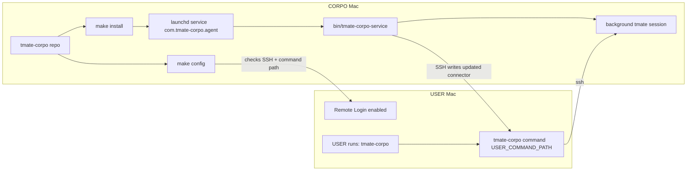

# tmate-corpo

`tmate-corpo` runs on the CORPO Mac. It keeps a background tmate session open on that CORPO Mac and publishes a simple `tmate-corpo` command to the USER Mac over SSH.

The USER runs `tmate-corpo` on their own Mac to connect into the current CORPO Mac tmate session. When the CORPO service restarts or creates a new tmate session, it rewrites the USER Mac command with the new tmate SSH command.

## Architecture



Run `make config`, `make install`, and service management commands on the CORPO Mac. Run only the generated `tmate-corpo` command on the USER Mac.

## Requirements

- macOS on the CORPO Mac running the service.
- `make` installed on the CORPO Mac. On macOS, install Xcode Command Line Tools if `make` is missing:

```bash
xcode-select --install
```

- `tmate` installed on the CORPO Mac:

```bash
brew install tmate
```

- Remote Login enabled on the USER Mac so CORPO can SSH into it:

```text
System Settings -> General -> Sharing -> Remote Login
```

## Install

On the CORPO Mac, configure the USER Mac once:

```bash
make config
```

This writes:

```text
.tmate-corpo.env
~/.tmate-corpo/env
```

It also checks whether the CORPO Mac can SSH into the USER Mac and whether the configured USER Mac command path is writable. If either check fails, it prints the exact next steps, such as running `ssh-copy-id user@user-mac.local` from CORPO or switching to a user-writable path.

You can also configure by editing `.tmate-corpo.env` directly. Start from:

```bash
cp .tmate-corpo.env.example .tmate-corpo.env
```

Then install and start the LaunchAgent:

```bash
make install
```

By default, the USER Mac command is written to:

```text
/usr/local/bin/tmate-corpo
```

That path usually requires passwordless sudo for the USER Mac account. Configure with:

```bash
USER_COMMAND_PATH='/usr/local/bin/tmate-corpo' REMOTE_INSTALL_WITH_SUDO=1 make config
```

If you want a different location, set another absolute writable path on the USER Mac:

```bash
USER_COMMAND_PATH='/some/writable/path/tmate-corpo' make config
```

## Use

On the USER Mac:

```bash
tmate-corpo
```

To print the raw tmate SSH command instead of connecting:

```bash
tmate-corpo --print
```

## Manage The Service

```bash
make config
make status
make doctor
make logs
make restart
make stop
make start
make uninstall
```

## Troubleshooting

If install fails with a USER Mac path error, first inspect the loaded config and remote path check:

```bash
make doctor
```

For the default `/usr/local/bin/tmate-corpo` setup, use passwordless sudo on the USER Mac:

```bash
USER_MAC=macmini USER_COMMAND_PATH='/usr/local/bin/tmate-corpo' REMOTE_INSTALL_WITH_SUDO=1 make config
make install
```

`make doctor` prints the resolved path on the USER Mac and reports whether the CORPO Mac can create or write it.

## Files

- `Makefile` is the public command surface.
- `bin/tmate-corpoctl` installs and controls the macOS LaunchAgent.
- `bin/tmate-corpo-service` is the long-running background service.
- `lib/common.sh` contains shared config, tmate, SSH, and connector publishing helpers.

The installer copies runtime files into:

```text
~/.tmate-corpo/
```

The LaunchAgent plist is written to:

```text
~/Library/LaunchAgents/com.tmate-corpo.agent.plist
```
